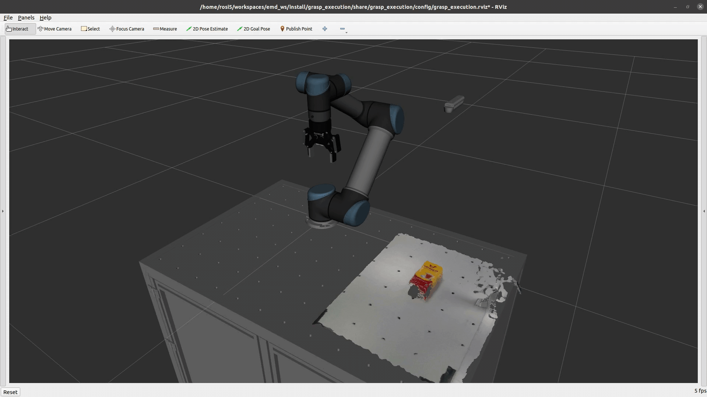
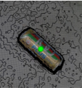
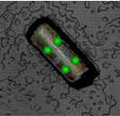

# Easy Manipulation Deployment

Modular ROS 2 manipulation packages for grasp planning, grasp execution, and workcell deployment.


[](https://easy-manipulation-deployment-docs.readthedocs.io/en/latest/?badge=latest)
[](https://github.com/Mukaram01/Easy_Manipulator_Improved/actions/workflows/humble-ci.yml)
[](https://github.com/ros-industrial/easy_manipulation_deployment/blob/master/LICENSE)

 

This package was tested with [easy_perception_deployment](https://github.com/ros-industrial/easy_perception_deployment), but any perception system publishing compatible ROS 2 messages will work.


## Workcell Studio

Workcell Studio is the internal configurable robotic-cell platform direction in this repository. It focuses on generating, validating, and integrating reusable workcell artifacts while preserving safe default workflows (fake hardware first, offline/dry-run validation first).

Sorting is one scenario template inside Workcell Studio, not the product itself.

Roadmap: `docs/manuals/WORKCELL_STUDIO_ROADMAP.md`

Workcell Studio capability catalog lives at `catalog/capabilities/` and is now the default registry for offline capability resolution tooling. Workcell Studio also includes a grasp strategy catalog at `catalog/grasp_strategies/` for offline `grasp_strategy/v1` metadata. Both catalogs remain metadata-only, offline-first, and safe/dry-run oriented (no robot-motion runtime changes). See `docs/manuals/INDUSTRIAL_CAPABILITY_CONTRACTS.md`.
Generated workcell artifacts now preserve selected validated grasp strategy metadata in scene manifests, task recipes, commissioning summaries, package README output, and generated bundle summary JSON; runtime robot behavior remains unchanged.

### Workcell Studio + workcell_builder architecture


### Workcell Studio task authoring (placement workflow)

`workcell_builder` is the primary Workcell Studio UI for pick/place setup. In normal operation, EPD/live perception provides object pose and class/color; the builder defines **where the object goes**.

- Pick source = where the object comes from (for live perception use `EPD detected object` scoped by `pick_zone_main`).
- Place target = where the robot should release (for example `bin_red`, `bin_blue`, `table_drop_zone`, `fixture_slot`, `conveyor_drop_zone`, or a custom pose).
- Task setup defines `pick_place`, grasp/release strategy, approach/retreat distances, and routing rule to a selected place target.
- Streamlit/dashboard tools remain optional reporting/orchestration helpers and do not replace `workcell_builder`.


- Qt Scene3D in `workcell_builder` is a Debug 3D Preview / experimental legacy preview for inspection; generated scene files and ROS package outputs remain the backend contract (robot, end-effector, STL/object import, package generation, scene generation), and RViz/MoveIt remains the planning and visualization truth for simulation validation.
- Workcell Studio catalogs and validators are backend intelligence used to improve builder selections and post-generation validation.
- The exported builder-facing catalog is `workcell_builder/workcell_builder/templates/workcell_studio_catalog.yaml`, generated by `scripts/export_workcell_builder_catalog.py`.
- CLI/wizard/preview tools are automation and testing helpers; they do **not** replace the `workcell_builder` UI workflow.
- If a Streamlit layer is added later, it should be orchestration/dashboard only, not a replacement for `workcell_builder`.

## Contents

- [Supported platform](#supported-platform)
- [Quick start (recommended path)](#quick-start-recommended-path)
- [Step-by-step install](#step-by-step-install)
- [Underlay sourcing order (important)](#underlay-sourcing-order-important)
- [Fake hardware vs real hardware](#fake-hardware-vs-real-hardware)
- [Common scenarios](#common-scenarios)
- [Troubleshooting](#troubleshooting)
- [Version notes / advanced compatibility](#version-notes--advanced-compatibility)
- [Operator manual and validation report](#operator-manual-and-validation-report)


## Operator manual and validation report

- Operator + commissioning manual: `docs/manuals/WORKCELL_OPERATOR_MANUAL.md`
- Industrial capability contracts manual: `docs/manuals/INDUSTRIAL_CAPABILITY_CONTRACTS.md`
- Task recipe schema manual: `docs/manuals/TASK_RECIPE_V1.md`
- Workcell project dashboard manual: `docs/manuals/WORKCELL_PROJECT_DASHBOARD.md`
- EMD grasp bridge payload manual: `docs/manuals/EMD_GRASP_BRIDGE_PAYLOAD.md`
- Detected objects snapshot manual: `docs/manuals/DETECTED_OBJECTS_V1.md`
- Real D435i + EPD pipeline manual: `docs/manuals/REAL_D435I_EPD_PIPELINE.md`
- Cell readiness preflight manual: `docs/manuals/CELL_READINESS_PREFLIGHT.md`
- Validation-only preflight helper:

```bash
./scripts/preflight_workcell.sh
```

- Launch smoke preflight (validation + headless launch readiness checks):

```bash
./scripts/preflight_workcell.sh --with-smoke
```

- Single-scene launch smoke check:

```bash
./scripts/smoke_launch_scenes.sh ur5_2f_test
```

- All-scene launch smoke check:

```bash
./scripts/smoke_launch_scenes.sh
```

- Generate markdown reports:

```bash
./scripts/generate_scene_validation_report.py
./scripts/generate_scene_self_test_report.py
./scripts/generate_task_recipe_report.py
./scripts/generate_task_recipe_dry_run_report.py
./scripts/generate_task_execution_plan_report.py
./scripts/generate_smoke_launch_report.py
```

Validation preflight checks manifests/files only. Smoke launch preflight verifies `run_grasp_execution` reaches readiness markers headlessly. Smoke checks do **not** validate full grasp execution quality, EPD perception, camera hardware, or physical robot behavior. See `docs/manuals/WORKCELL_OPERATOR_MANUAL.md` for operator workflow details.

Scene self-test metadata (`self_test` in each scene manifest) defines a deterministic commissioning object pose for offline checks. It is metadata-only: no robot launch, no EPD/camera requirement, and no physical hardware requirement.

Workcell project generation also emits a static offline dashboard at `dashboard/index.html` for read-only project review. **The dashboard is a read-only offline project summary. It does not replace the existing GUI and does not control the robot.**

```bash
./scripts/check_scene_self_tests.sh
./scripts/check_task_recipes.sh
./scripts/check_task_recipe_dry_runs.sh
./scripts/check_task_execution_plans.sh
./scripts/check_emd_grasp_bridge.sh
./scripts/check_cell_definitions.sh
```

### Cell Definition v1 (offline contract)

Cell Definition v1 introduces a single high-level YAML for defining a robotic cell (robot, tool, camera, environment, objects, task rules, safe-home metadata) and generating offline preview artifacts for commissioning.

Quick commands:

```bash
./scripts/check_cell_definitions.sh

python3 scripts/validate_cell_definition.py tests/fixtures/cell_definition_sort_by_colour.yaml

python3 scripts/generate_scene_from_cell_definition.py   tests/fixtures/cell_definition_sort_by_colour.yaml   --output-dir /tmp/emd_cell_preview
```

Reference: `docs/manuals/CELL_DEFINITION_V1.md`

### Task recipes

`task_recipe/v1` metadata describes what the workcell is trying to do (job intent), not only how to pick/place.

Examples include:

- colour sorting
- shape sorting
- garbage sorting
- reject handling
- inspection routing
- palletising
- binning

Current scope includes contract validation/reporting plus an offline dry-run resolver. Runtime execution remains backward compatible and existing launch behavior is unchanged.

Future GUI direction: users should be able to pick task logic profiles like `sort_by_colour`, `sort_by_shape`, or `garbage_sorting`, then generate offline-validated artifacts before runtime integration.

### Offline task recipe dry-run

This is the first step from static YAML to useful industrial behaviour. It checks that a simulated/self-test object can be routed through the recipe decision rules to a concrete destination/action.

Examples of expected routing outcomes:

- red object -> `bin_a`
- blue object -> `bin_b`
- unknown object -> `reject_bin`
- light part -> suction bin

The dry-run does **not** execute the robot, and does **not** validate physical reachability or collision-free planning. It prepares metadata for future UI/runtime execution layers.

```bash
./scripts/check_task_recipe_dry_runs.sh
./scripts/generate_task_recipe_dry_run_report.py
./scripts/preflight_workcell.sh
```

### Offline task execution plans

This is the next offline step after task recipe dry-run. It converts the already-matched dry-run decision into a deterministic, operator-readable ordered job sequence for commissioning review, future UI layers, and future runtime integration.

It does **not** move the robot and does **not** validate real collision-free path feasibility.

```bash
./scripts/check_task_execution_plans.sh
./scripts/generate_task_execution_plan.py
./scripts/generate_task_execution_plan_report.py
./scripts/preflight_workcell.sh
```

Generated artifacts:

- Per-scene plans: `docs/manuals/generated_execution_plans/<scene>_execution_plan.md`
- Per-scene machine JSON: `docs/manuals/generated_execution_plans/<scene>_execution_plan.json`
- Fleet report: `docs/manuals/latest_task_execution_plan_report.md`

### Runtime plan -> EMD grasp bridge payload

Use the new offline bridge to translate `runtime_execution_plan/v1` into an EMD-compatible payload preview:

```bash
python3 scripts/convert_runtime_plan_to_emd_grasp.py   --runtime-plan tests/fixtures/emd_grasp_bridge/valid_single_box_runtime_plan.json   --json

./scripts/check_emd_grasp_bridge.sh
```

This is offline by default and does not change existing `run_grasp_execution` behavior.

### Real perception bridge (D435i/EPD -> task runtime)

The intended direction is now explicit:

```text
GUI / workcell definition
    ↓
environment + robot + gripper + sensor + task
    ↓
D435i/EPD detected objects
    ↓
task logic
    ↓
validated runtime plan
    ↓
existing EMD grasp execution
```

Operator path uses `detected_objects/v1` snapshots captured from live EPD topics. Mock object fixtures remain for tests/CI only.

### Workcell commissioning bundles

Workcell commissioning bundles are offline handover/export packages for one scene/workcell. They collect scene metadata, validation summaries, task recipe dry-run summaries, execution plan artifacts, and an operator checklist into one reviewable package.

Use bundles for commissioning review, versioned handover, archive traceability, and future UI import/export workflows.

This package is offline-only and **not** a safety certificate. It does **not** prove real robot reachability or collision-free runtime execution.

```bash
./scripts/export_workcell_bundle.py ur5_2f_test
./scripts/export_workcell_bundle.py ur5_2f_test --zip --force
./scripts/inspect_workcell_bundle.py dist/workcell_bundles/ur5_2f_test
./scripts/inspect_workcell_bundle.py dist/workcell_bundles/ur5_2f_test.zip
./scripts/check_workcell_bundles.sh
./scripts/preflight_workcell.sh
```


### Generate a workcell package from a cell definition

Generate a reviewable ROS 2 scene package from a high-level cell definition:

```bash
python3 scripts/generate_workcell_from_cell_definition.py   tests/fixtures/cell_definition_sort_by_colour.yaml   --output-dir /tmp/generated_workcells   --package-name generated_colour_sorting_cell   --force

python3 scripts/validate_scene_contract.py /tmp/generated_workcells/generated_colour_sorting_cell/scene_manifest.yaml
./scripts/check_generated_workcells.sh
```

Generated package contents include:
- `package.xml`, `CMakeLists.txt`
- `scene_manifest.yaml` and `workcell.yaml`
- `README.md`
- generated previews/reports under `generated/`

Safety note: generated package metadata is for offline review and commissioning only. It is not proof of physical reachability, collision-free runtime behavior, or machine safety certification.

### Generated scenes from workcell_builder

New scenes generated from `workcell_builder` now include commissioning-oriented contract defaults in `scene_manifest.yaml` (or `workcell.yaml`): `self_test`, `task_recipe`, and `home_return` metadata blocks plus explicit `home_return.safe_joint_state` (empty list allowed when a named target is provided). These defaults are designed for offline validation/export workflows first, and are intended to be edited/tuned per cell before runtime use.

Commissioning checks for generated templates/scenes:

```bash
./scripts/check_workcell_builder_templates.sh
./scripts/preflight_workcell.sh
./scripts/check_workcell_bundles.sh <generated_scene_name>
```

Future click-driven workflow this enables:
1. create/import environment
2. select robot
3. select gripper/tool
4. define objects/support surfaces
5. choose task type
6. generate scene
7. validate scene
8. export commissioning bundle
9. run simulation smoke test
10. commission physical cell

**Strong limitation:** generated metadata is a commissioning starting point, **not** a safety certificate and **not** proof of physical reachability/collision-free runtime behavior.

### Scene creation helper tools

These helper tools make the existing scene creation flow easier without replacing `workcell_builder`.

```bash
python3 scripts/report_workcell_builder_paths.py
python3 scripts/check_scene_readiness.py --workcell-root <path>
python3 scripts/generate_scene_import_checklist.py <mesh.stl>
python3 scripts/environment_layout_to_scene_checklist.py <layout.yaml>
```

```yaml
task_recipe:
  id: colour_sort_demo
  name: Colour Sort Demo
  type: sort
  enabled: true
  inputs:
    perception_source: epd
    required_attributes: [class, colour, shape]
  pick:
    object_source: perception
    grasp_strategy: auto
    allowed_grasp_methods: [finger]
  decision_rules:
    - id: default_reject
      when:
        default: true
      destination: reject_bin
  destinations:
    - id: reject_bin
      frame_id: world
      pose_xyz: [0.20, 0.0, 0.12]
      pose_rpy: [0.0, 0.0, 0.0]
      action: reject
```

---

## Supported platform

- **Supported/tested:** Ubuntu 22.04 + ROS 2 Humble
- Other platforms and experimental combinations are listed later in [Version notes / advanced compatibility](#version-notes--advanced-compatibility)

> Reproducibility expectation: run bootstrap/build from a clean shell that only sources `/opt/ros/humble/setup.bash`. Do not rely on pre-sourced overlays from other workspaces.
>
> Intentional overlay note: this workspace can intentionally override underlay packages (`ruckig`, `tesseract_monitoring`, `tesseract_msgs`, `tesseract_rosutils`) when using the source-overlay flow. Include `--allow-overriding ruckig tesseract_monitoring tesseract_msgs tesseract_rosutils` in manual `colcon build` commands to avoid duplicate-package confusion and future hard errors.

## Quick start (recommended path)

Use this **single canonical flow** for a clean Ubuntu 22.04 + ROS 2 Humble machine with EPD enabled.

> EPD is an **underlay workspace**. Build EPD first in `~/epd_ros2_ws`, then consume it from this workspace via `--epd-underlay`. Do not rebuild EPD packages inside `~/workcell_ws`.

```bash
# Start from a clean shell.
unset AMENT_PREFIX_PATH CMAKE_PREFIX_PATH COLCON_PREFIX_PATH
source /opt/ros/humble/setup.bash

# EPD must already be built in its own workspace.
# Use local_setup.bash so it does not accidentally source old workcell overlays.
source ~/epd_ros2_ws/install/local_setup.bash

mkdir -p ~/workcell_ws/src
cd ~/workcell_ws/src
git clone https://github.com/Mukaram01/Easy_Manipulator_Improved.git easy_manipulation_deployment
cd ~/workcell_ws/src/easy_manipulation_deployment

./fix_and_build_humble.sh \
  --workspace ~/workcell_ws \
  --check-prereqs \
  --install-prereqs \
  --build \
  --profile full \
  --epd-underlay ~/epd_ros2_ws

source ~/workcell_ws/install/setup.bash
```

Notes:
- `cereal` is treated as a system/header-only dependency and is supplied through `libcereal-dev` via rosdep override resolution.
- If `src/cereal` is imported by the dependency manifest, the installer intentionally writes `COLCON_IGNORE` + `AMENT_IGNORE` so colcon does not try to build upstream cereal sandbox/tests/examples.
- Do **not** manually build `cereal` in this workspace.

### Verify the install

```bash
ros2 pkg prefix epd_msgs
ros2 pkg prefix emd_grasp_planner
ros2 pkg prefix emd_grasp_execution
ros2 pkg prefix run_grasp_planner
ros2 pkg prefix run_grasp_execution
ros2 pkg prefix run_waypoint_execution
ros2 pkg prefix workcell_builder
ros2 pkg prefix moveit_ros_perception
colcon list --base-paths ~/workcell_ws/src --names-only | grep -x cereal && echo "ERROR cereal visible" || echo "OK cereal hidden"
```

### First launch smoke test

Terminal 1:

```bash
ros2 launch ur5_2f_test demo.launch.py use_fake_hardware:=true
```

Terminal 2:

```bash
unset AMENT_PREFIX_PATH CMAKE_PREFIX_PATH COLCON_PREFIX_PATH
source /opt/ros/humble/setup.bash
source ~/epd_ros2_ws/install/local_setup.bash
source ~/workcell_ws/install/setup.bash
ros2 node list
ros2 topic list | grep -E 'joint_states|robot_description|planning_scene|tf'
```

### Grasp planner smoke test

```bash
ros2 launch run_grasp_planner grasp_planner_2f_launch.py
```

If EPD is not running, warnings such as `EPD service unavailable` are expected. The install is still valid when the node and interfaces are present (for example `/grasp_planning_node`, `/grasp_requests`, and `/query_planner_interface`).

Workcell Builder note: generated scenes default to `enable_octomap:=true` and expect a RealSense-style pointcloud topic at `/camera/camera/depth/color/points`. For simulation-only testing without a camera, launch with `enable_octomap:=false`.

## Underlay sourcing order (important)

1. Always source `/opt/ros/humble/setup.bash` first.
2. Then source `~/epd_ros2_ws/install/local_setup.bash`.
3. Source `~/workcell_ws/install/setup.bash` only **after** `~/workcell_ws` is successfully built.
4. Do not source an old `~/workcell_ws/install/setup.bash` before rebuilding a deleted or half-built workspace.

## Step-by-step install

The canonical helper-script flow above is the supported install path for most users.

- If you need manual colcon surgery or package-by-package debugging, use manual commands as **Advanced / maintainers only**.
- Keep manual flows aligned with the same underlay order and package expectations as the canonical helper flow.

## Advanced / maintainers only (manual workspace flow)

Use this only for debugging and maintenance. The helper script remains the recommended install/build path.

```bash
mkdir -p ~/workcell_ws/src
cd ~/workcell_ws/src
git clone https://github.com/Mukaram01/Easy_Manipulator_Improved.git easy_manipulation_deployment
cd ~/workcell_ws

unset AMENT_PREFIX_PATH CMAKE_PREFIX_PATH COLCON_PREFIX_PATH
source /opt/ros/humble/setup.bash
source ~/epd_ros2_ws/install/local_setup.bash

vcs import --recursive --skip-existing src < src/easy_manipulation_deployment/dependencies/emd_epd_ws.repos
./src/easy_manipulation_deployment/scripts/fix_workspace_layout.sh
touch src/cereal/COLCON_IGNORE src/cereal/AMENT_IGNORE 2>/dev/null || true
rosdep update
rosdep install --from-paths src --ignore-src -r -y --rosdistro humble \
  --skip-keys "qt_advanced_docking tesseract_visualization"

colcon build --symlink-install \
  --allow-overriding ruckig tesseract_monitoring tesseract_msgs tesseract_rosutils \
  --packages-skip tesseract_qt QtADS qtadvanceddocking tesseract_rviz tesseract_planning_server

source install/setup.bash
```

## Scene contract validation

Scene packages can optionally include a scene manifest (`scene_manifest.yaml` or `workcell.yaml`) with a shared contract used for pre-launch validation.

Required manifest fields:

- `scene.name`
- `robot.model`
- `robot.planning_group`
- `robot.base_frame`
- `robot.ee_link`
- `robot.home_named_target` **or** `home_return.safe_joint_state`
- `end_effector.type`
- `end_effector.brand`
- `end_effector.grasp_frame`
- `end_effector.allowed_touch_links`
- `environment.support_surface_link`
- `perception.input_frame_options`

`workcell_builder`-generated scene packages should emit the same manifest so they can be validated with the same tools before launch.

Validate one scene package:

```bash
./scripts/validate_scene_contract.py ur5_2f_test
```

Validate all currently tracked scene packages:

```bash
./scripts/check_all_scenes.sh
```

The all-scenes script reports `SKIP` when a scene package is not installed in the current ROS environment, and only fails when an installed scene does not satisfy the contract.

## Fake hardware vs real hardware

All scene launch files default to **simulated (fake) hardware** so you can develop, test, and visualise motions without a physical robot.

| Mode | `use_fake_hardware` | Hardware interface used |
|------|-------------------|------------------------|
| Fake / simulated (default) | `true` | `fake_components/GenericSystem` via ros2_control |
| Real robot | `false` | Physical driver (e.g. `ur_robot_driver`) |

### Default: fake hardware (no robot required)

```bash
# All scene launch files use use_fake_hardware:=true by default.
# The argument can be omitted – both lines below are equivalent:
ros2 launch ur5_2f_test demo.launch.py
ros2 launch ur5_2f_test demo.launch.py use_fake_hardware:=true
```

The same applies to every other scene package:

```bash
ros2 launch ur3_suction_test  demo.launch.py
ros2 launch ur5_3f_test       demo.launch.py
ros2 launch ur5_airpick4_test demo.launch.py
ros2 launch ur10_2f_test      demo.launch.py
ros2 launch suction_test      demo.launch.py
```

### Launch **any** scene package (including Workcell Builder generated scenes)

If a scene package contains `launch/demo.launch.py`, you can launch it with the same pattern:

```bash
ros2 launch <scene_package> demo.launch.py [use_fake_hardware:=true|false]
```

Examples:

```bash
# Existing scene package from this repo (fake hardware)
ros2 launch ur5_3f_test demo.launch.py use_fake_hardware:=true

# Existing scene package on a real robot
ros2 launch ur5_3f_test demo.launch.py use_fake_hardware:=false

# New scene generated with Workcell Builder
ros2 launch my_generated_scene demo.launch.py use_fake_hardware:=true
ros2 launch my_generated_scene demo.launch.py use_fake_hardware:=false
```

Tip: you can verify a scene package exists before launch:

```bash
ros2 pkg prefix <scene_package>
```

### Switching to a real UR robot

1. **Install and start `ur_robot_driver`** (ships separately from this repository):

   ```bash
   sudo apt install -y ros-humble-ur
   ```

2. **Launch the UR driver** with your robot's IP address *before* starting the scene launch:

   ```bash
   ros2 launch ur_robot_driver ur_control.launch.py \
     ur_type:=ur5 \
     robot_ip:=192.168.1.102
   ```

   Replace `ur5` with your robot model (`ur3`, `ur10`, …) and `192.168.1.102` with the actual IP shown on the teach pendant.

3. **Launch the scene** with `use_fake_hardware:=false`:

   ```bash
   ros2 launch ur5_2f_test demo.launch.py use_fake_hardware:=false
   ```

   The scene URDF skips the simulated `fake_components/GenericSystem` block when this flag is `false`, so ros2_control picks up the real hardware interface provided by the driver.

> **Safety reminder:** always verify E-stop and speed limits on the teach pendant before enabling real-hardware mode.

## Common scenarios

### Build with GUI / Studio tools

The default supported path is headless/non-GUI. Only opt in if you need Tesseract Studio / Qt widgets.

Install the extra Qt/GUI system packages first:

```bash
sudo apt install -y \
  qtbase5-dev qtchooser qt5-qmake qtbase5-dev-tools libqt5svg5-dev
```

For the default manual/headless path, keep the GUI packages disabled so a plain `colcon build` does not try to compile `tesseract_qt` or Qt ADS. The checkout folder is `qtadvanceddocking`, but colcon may discover that package as `QtADS` in the workspace.

```bash
cd ~/workcell_ws
./src/easy_manipulation_deployment/scripts/fix_workspace_layout.sh
colcon build --symlink-install 
```

If you want an explicit non-GUI full-workspace example that matches the Humble helper-script defaults from the logs, skip the GUI packages by their discovered names (with the checkout folder as an extra fallback) or use the helper script without `--with-gui`:

```bash
cd ~/workcell_ws
./src/easy_manipulation_deployment/scripts/fix_workspace_layout.sh
colcon build --symlink-install  \
  --packages-skip tesseract_qt QtADS qtadvanceddocking
```

```bash
cd ~/workcell_ws/src/easy_manipulation_deployment
./fix_and_build_humble.sh --workspace ~/workcell_ws --check-prereqs --install-prereqs --build --profile full --epd-underlay ~/epd_ros2_ws
```

`fix_workspace_layout.sh` creates `COLCON_IGNORE` markers for `src/tesseract_qt` and `src/qtadvanceddocking` unless you explicitly opt into GUI support. If you prefer to manage that manually, either leave those markers in place or pass `--packages-skip tesseract_qt QtADS` to `colcon build` (optionally also adding `qtadvanceddocking` as a compatibility fallback for folder-based troubleshooting notes). To opt into the GUI-enabled path instead, use `./src/easy_manipulation_deployment/scripts/fix_workspace_layout.sh --with-gui` for the manual flow or `./fix_and_build_humble.sh --workspace ~/workcell_ws --check-prereqs --install-prereqs --build --profile full --epd-underlay ~/epd_ros2_ws --with-gui` for the helper-script flow.

For an explicit GUI-enabled manual build, remove those markers by opting into GUI mode when syncing the workspace layout. Build in stages so `tesseract_commonConfig.cmake` is exported before `tesseract_qt` configures:

```bash
cd ~/workcell_ws
vcs import --recursive --skip-existing src < src/easy_manipulation_deployment/dependencies/emd_epd_ws.repos
./src/easy_manipulation_deployment/scripts/fix_workspace_layout.sh --with-gui

# 1) Build/install the core package set that exports tesseract_commonConfig.cmake
colcon build --symlink-install  \
  --packages-skip tesseract_qt QtADS qtadvanceddocking tesseract_rviz tesseract_planning_server

# 2) Refresh the overlay environment from the staged install
source install/setup.bash

# 3) Build tesseract_qt and remaining downstream GUI packages
colcon build --symlink-install  \
  --packages-up-to tesseract_qt tesseract_rviz tesseract_planning_server
```

Before step (3), verify `tesseract_qt` metadata declares a dependency on the package that exports `tesseract_common` so colcon ordering is deterministic:

```bash
grep -nE "<(depend|build_depend|exec_depend)>tesseract_common</(depend|build_depend|exec_depend)>" \
  ~/workcell_ws/src/tesseract_qt/package.xml
```

If that check is empty, run `./src/easy_manipulation_deployment/scripts/apply_upstream_patches.sh` from the workspace root to apply compatibility updates and inject the dependency declaration.

If you use the helper script instead, the equivalent GUI-enabled path is:

```bash
cd ~/workcell_ws/src/easy_manipulation_deployment
./fix_and_build_humble.sh --workspace ~/workcell_ws --check-prereqs --install-prereqs --build --profile full --epd-underlay ~/epd_ros2_ws --with-gui
```

`tesseract_qt` and the Qt ADS checkout (`qtadvanceddocking`, package name `QtADS`) remain optional in this repository. When skipping them manually with colcon, use the discovered package name `QtADS` and optionally also `qtadvanceddocking` as a compatibility fallback.

### Clean rebuild

```bash
cd ~/workcell_ws
rm -rf build install log
./src/easy_manipulation_deployment/scripts/fix_workspace_layout.sh
colcon build 
```

Helper-script equivalent:

```bash
cd ~/workcell_ws/src/easy_manipulation_deployment
./fix_and_build_humble.sh --workspace ~/workcell_ws --check-prereqs --build --clean
```

### Helper-script phase model (opt-in mutation)

`fix_and_build_humble.sh` now separates execution into explicit phases:

- `--check-prereqs`: read-only validation.
- `--install-prereqs`: mutating apt/pip installation.
- `--build`: workspace build only (`colcon build`).

The script also supports `--dry-run` and writes a machine-readable summary to
`<workspace>/fix_and_build_summary.json` (or prints JSON in dry-run mode).

**Local development (copy/paste):**

```bash
cd ~/workcell_ws/src/easy_manipulation_deployment
./fix_and_build_humble.sh \
  --workspace ~/workcell_ws \
  --check-prereqs \
  --install-prereqs \
  --build \
  --profile full
```

**Locked-down enterprise host (no machine mutation):**

```bash
cd /opt/workcell_ws/src/easy_manipulation_deployment
./fix_and_build_humble.sh \
  --workspace /opt/workcell_ws \
  --check-prereqs \
  --dry-run
```

**CI runner (pre-provisioned image):**

```bash
./fix_and_build_humble.sh \
  --workspace "$GITHUB_WORKSPACE" \
  --check-prereqs \
  --build \
  --profile minimal \
  --clean
```

### Rebuild only one package

```bash
cd ~/workcell_ws
./src/easy_manipulation_deployment/scripts/fix_workspace_layout.sh
colcon build --packages-select emd_grasp_planner 
```

For dependency-first troubleshooting of the planning stack:

```bash
cd ~/workcell_ws
colcon build --packages-select tesseract_geometry 2>&1 | tee /tmp/colcon_tesseract_geometry.log
colcon build --packages-select tesseract_collision 2>&1 | tee /tmp/colcon_tesseract_collision.log
rg -n 'IMPORTED_LOCATION not set for imported target "octomap"' /tmp/colcon_tesseract_geometry.log /tmp/colcon_tesseract_collision.log
```

### Dynamic safety tests

Dynamic safety is part of the grasp execution workflow.

```bash
source ~/workcell_ws/install/setup.bash
./src/easy_manipulation_deployment/scripts/validate_workspace_assets.sh
ros2 launch run_grasp_execution grasp_execution.launch.py scene_package:=ur5_3f_test
```

If you are validating packages only, run the workspace tests after a build:

```bash
cd ~/workcell_ws
colcon test
colcon test-result --verbose
```

### Using `--symlink-install` if desired

The main supported quick-start path uses a plain build:

```bash
cd ~/workcell_ws
./src/easy_manipulation_deployment/scripts/fix_workspace_layout.sh
colcon build 
```

If you are actively developing packages and want editable install behavior, use:

```bash
cd ~/workcell_ws
./src/easy_manipulation_deployment/scripts/fix_workspace_layout.sh
colcon build --symlink-install 
```

Some helper scripts and source-overlay workflows still use `--symlink-install`, especially for full-profile development workspaces.


## Dependency manifests

- Canonical manifest: `dependencies/emd_epd_ws.repos`.
- Legacy compatibility manifest: `tesseract.repos` (root-level).
- Canonical import command:

```bash
cd ~/workcell_ws
vcs import --recursive --skip-existing src < src/easy_manipulation_deployment/dependencies/emd_epd_ws.repos
```

Repository scripts now resolve manifests in this order: canonical first, then legacy with a warning so existing workspaces keep working during migration.

## Troubleshooting

### OSQP / TrajOpt consistency (read this first)

- Do **not** manually build `src/osqp` or `src/osqp-eigen` as normal colcon packages in the standard install flow. The helper script owns OSQP compatibility handling for this repository.
- `trajopt_sco` 0.33.0 requires the OSQP v1 API (`OSQPSolver`, `OSQPInt`, `OSQPCscMatrix`, `osqp_update_data_vec`, `osqp_update_data_mat`, `OSQPSettings::warm_starting`, `OSQP_NO_ERROR`, `OSQP_ALGEBRA_LOAD_ERROR`). The upstream `trajopt_sco` package declares `depend>osqp</depend>` and `find_package(osqp QUIET)`; this repository pins `osqp` to `v1.0.0` and `osqp-eigen` to `v0.11.0` in both dependency manifests.
- Do not allow Jammy `libosqp-dev` to satisfy `osqp` or `osqp_vendor`; it exposes the older `OSQPWorkspace`/`warm_start` API. `scripts/rosdep_overrides.yaml` intentionally maps those keys to no apt package, and the build helpers skip the OSQP rosdep keys so the pinned source provider is used.
- Run `scripts/preflight_trajopt_osqp_compatibility.sh <workspace>` after installing the pinned OSQP provider if `trajopt_sco` fails to configure or compile. It reports wrong TrajOpt commits, stale/flattened `trajopt_sco` checkouts, duplicate packages, incompatible OSQP headers, and `/usr` OSQP provider leakage.
- `trajopt_sco` can fail when OSQP v0.6 and OSQP v1 headers/libraries are mixed.
- Typical symptoms include compile errors mentioning missing `OSQPSolver`, `OSQPInt`, `OSQPFloat`, or `OSQPCscMatrix`.
- Fix strategy: keep one consistent OSQP strategy through the helper script and dependency overlay. Do **not** randomly skip TrajOpt packages (`trajopt_sco`, `trajopt_sqp`, `trajopt_ifopt`) in full-profile EPD builds.
- Only as an advanced troubleshooting step, if your machine has contaminated `/usr/local` OSQP headers/libs from old manual installs, clean those artifacts and rebuild from a clean shell.

### Optional GUI skips vs required planning/perception packages

For normal headless builds, skipping these optional GUI packages is expected:

- `tesseract_qt`
- `qtadvanceddocking` / `QtADS`
- `tesseract_rviz`
- `tesseract_planning_server`

Do **not** classify these as optional for EPD-enabled full manipulation builds:

- `trajopt_sco`, `trajopt_sqp`, `trajopt_ifopt`
- `tesseract_motion_planners`
- `epd_msgs`

### Old ROS-installed Ruckig headers vs source-built Ruckig on Humble

If the compiler picks `/opt/ros/humble/include/ruckig` but the linker picks a newer workspace-built `ruckig`, you can get linker errors mentioning older symbols such as `PositionStep1` or `VelocityStep2`.

Recommended recovery:

```bash
unset AMENT_PREFIX_PATH CMAKE_PREFIX_PATH COLCON_PREFIX_PATH
source /opt/ros/humble/setup.bash
cd ~/workcell_ws
rm -rf build install log
./src/easy_manipulation_deployment/scripts/fix_workspace_layout.sh
colcon build 
```

Do **not** remove `ros-humble-ruckig` just to build this repository; that can remove unrelated MoveIt packages.

### Missing `trajoptConfig.cmake` during configure

`scripts/fix_workspace_layout.sh` does **not** generate synthetic TrajOpt package config files. The supported path is to make sure the real TrajOpt packages are discoverable in your workspace (or installed in an underlay), then rerun the layout helper and rebuild.

Recommended recovery:

```bash
cd ~/workcell_ws
vcs import --recursive --skip-existing src < src/easy_manipulation_deployment/dependencies/emd_epd_ws.repos
./src/easy_manipulation_deployment/scripts/fix_workspace_layout.sh
colcon build --packages-up-to trajopt_sco
```

If `trajoptConfig.cmake` is still missing, verify `src/trajopt`, `src/trajopt_common`, and `src/trajopt_sco` exist and that your active underlay/overlay environment is sourced correctly before running a full build.

### Missing `tesseract_motion_plannersConfig.cmake` while building `tesseract_rosutils`

If `colcon build` stops in `tesseract_rosutils` with an error that CMake cannot find `tesseract_motion_plannersConfig.cmake` (or `tesseract_motion_planners-config.cmake`), your active environment does not expose the CMake config package exported by Tesseract motion planners.

> Important: `tesseract_motion_planners` is often a **CMake package name**, not always a direct colcon package name. A command like `colcon build --packages-up-to tesseract_motion_planners` can fail with “package not found” even when the dependency is valid.

Recommended recovery (source-overlay path):

```bash
cd ~/workcell_ws
vcs import --recursive --skip-existing src < src/easy_manipulation_deployment/dependencies/emd_epd_ws.repos
./src/easy_manipulation_deployment/scripts/fix_workspace_layout.sh
colcon list | grep tesseract_motion_planners
colcon build --symlink-install  --packages-up-to tesseract_rosutils
```

If `colcon list` shows planner component packages (for example `tesseract_motion_planners_core`, `tesseract_motion_planners_simple`, `tesseract_motion_planners_ompl`, `tesseract_motion_planners_descartes`, `tesseract_motion_planners_trajopt`), build those first and then rebuild `tesseract_rosutils`.

Then source the rebuilt overlay and continue with a full workspace build:

```bash
source ~/workcell_ws/install/setup.bash
colcon build --symlink-install 
```

Binary-package path: install/verify `ros-${ROS_DISTRO}-tesseract-motion-planners`, open a fresh shell, source `/opt/ros/${ROS_DISTRO}/setup.bash`, and rebuild `tesseract_rosutils`.

### Optional GUI package issues

If `tesseract_qt` fails to link because the ADS target name differs on your system, apply the included patch, verify metadata, and rebuild in stages:

```bash
cd ~/workcell_ws
./src/easy_manipulation_deployment/scripts/apply_upstream_patches.sh
colcon build --symlink-install  \
  --packages-skip tesseract_qt QtADS qtadvanceddocking tesseract_rviz tesseract_planning_server
source install/setup.bash
colcon build --symlink-install  \
  --packages-up-to tesseract_qt tesseract_rviz tesseract_planning_server
```

Qt ADS (`qtadvanceddocking`) may also require Qt private headers on some systems. If the build cannot find `qpa/qplatformnativeinterface.h`, install the distro package that provides the Qt private development headers for your Qt version before rebuilding.

If you do not need Studio / Qt widgets, keep the default non-GUI path or temporarily skip the GUI-facing packages:

```bash
for marker in \
  ~/workcell_ws/src/tesseract_qt/COLCON_IGNORE \
  ~/workcell_ws/src/tesseract_ros2/tesseract_rviz/COLCON_IGNORE \
  ~/workcell_ws/src/tesseract_ros2/tesseract_ros_examples/COLCON_IGNORE \
  ~/workcell_ws/src/tesseract_ros2/tesseract_planning_server/COLCON_IGNORE \
  ~/workcell_ws/src/tesseract_planning/tesseract_examples/COLCON_IGNORE; do
  [ -d "$(dirname "$marker")" ] && touch "$marker"
done
```

### `emd_dynamic_safety` / MoveIt / Ruckig mismatch on Humble

On Humble, test-only or overlay builds can expose a mismatch between the MoveIt-provided Ruckig headers and a newer source-built Ruckig library. Start from a clean shell, source only `/opt/ros/humble/setup.bash`, and rebuild the workspace before rerunning dynamic safety or grasp execution tests.

If you need the full source-overlay workflow, prefer the repository helper so its preflight checks run before building:

```bash
cd ~/workcell_ws/src/easy_manipulation_deployment
./fix_and_build_humble.sh --workspace ~/workcell_ws --check-prereqs --install-prereqs --build --profile full --epd-underlay ~/epd_ros2_ws --clean
```

### Clean shell / clean workspace recovery

If the workspace starts failing after switching branches, changing overlays, or reusing old build outputs, reset to a clean state:

```bash
unset AMENT_PREFIX_PATH CMAKE_PREFIX_PATH COLCON_PREFIX_PATH
source /opt/ros/humble/setup.bash
cd ~/workcell_ws
rm -rf build install log
./src/easy_manipulation_deployment/scripts/fix_workspace_layout.sh
rosdep install --from-paths src --ignore-src -r -y --rosdistro humble \
  --skip-keys "qt_advanced_docking tesseract_visualization"
colcon list --base-paths src --names-only | grep -E '^tesseract_motion_planners($|_)'
colcon build 
```

### `workbench_description` missing during `rosdep install`

If you see `Cannot locate rosdep definition for [workbench_description]`, the layout helper was not run before `rosdep install`.

```bash
cd ~/workcell_ws
./src/easy_manipulation_deployment/scripts/fix_workspace_layout.sh
test -L src/workbench_description -o -d src/workbench_description
rosdep install --from-paths src --ignore-src -r -y --rosdistro humble
```

### Duplicate package discovery errors

If `rosdep` or `colcon` reports duplicate packages in an older workspace, rerun the layout helper or remove the stale duplicate tree.

```bash
cd ~/workcell_ws
./src/easy_manipulation_deployment/scripts/fix_workspace_layout.sh
```

### Common dependency fixes

Boost missing components:

```bash
sudo apt install -y libboost-dev libboost-graph-dev libboost-program-options-dev \
  libboost-serialization-dev libboost-stacktrace-dev
cd ~/workcell_ws
rm -rf build install log
colcon build --symlink-install 
```

Cereal setup (header-only system dependency):

```bash
sudo apt install -y libcereal-dev
sudo mkdir -p /usr/lib/x86_64-linux-gnu/cmake/
sudo ln -sf /usr/share/cmake/cereal /usr/lib/x86_64-linux-gnu/cmake/cereal
colcon list --base-paths ~/workcell_ws/src --names-only | grep -x cereal && echo "ERROR cereal visible" || echo "OK cereal hidden"
```

`cereal` should come from `libcereal-dev`; do not manually build `src/cereal`. If `src/cereal` exists from `vcs import`, keep it hidden with `COLCON_IGNORE` + `AMENT_IGNORE`.

Boost serialization `library_version_type` error:

```bash
sudo sed -i '/#include <boost\/serialization\/item_version_type.hpp>/a #include <boost/serialization/library_version_type.hpp>' \
  /usr/include/boost/serialization/unordered_collections_load_imp.hpp
```

## Version notes / advanced compatibility

- **Supported baseline:** Ubuntu 22.04 + ROS 2 Humble + a C++17/libstdc++ baseline.
- **Experimental:** Ubuntu 24.04 + ROS 2 Jazzy is not the main supported path for this repository.
- `scripts/lib/build.sh` intentionally keeps `-DCMAKE_CXX_STANDARD=17` for the supported baseline.
- `dependencies/emd_epd_ws.repos` (canonical manifest) pins `ruckig` to `v0.15.3` (`37b6e7a`) so source builds stay on the pre-`std::format` line that still works with the Humble/Jammy toolchain. The legacy root-level `tesseract.repos` is retained as a compatibility fallback in scripts.
- `fix_and_build_humble.sh` supports explicit `--check-prereqs`, `--install-prereqs`, and `--build` phases for deterministic workflows.
- If you move to a newer `ruckig` release that requires `std::format`, you are also moving beyond the documented Humble/Jammy support envelope.

### Full-profile and helper-script notes

The repository helper remains the canonical bootstrap for full planning/development workspaces:

```bash
cd ~/workcell_ws/src/easy_manipulation_deployment
./fix_and_build_humble.sh --workspace ~/workcell_ws --check-prereqs --install-prereqs --build --profile full --epd-underlay ~/epd_ros2_ws
```

Use it when you explicitly need the Tesseract/TrajOpt planning overlays from source, overlay-aware `rosdep` skip keys, or the repo's additional preflight checks.

### Optional GUI details

- `tesseract_qt` and Qt ADS are optional. The repository checkout is `qtadvanceddocking`, while colcon may discover the package as `QtADS`; use `--packages-skip tesseract_qt QtADS` (optionally also `qtadvanceddocking`) for manual skips.
- The default install path stays headless/non-GUI, and `scripts/fix_workspace_layout.sh` keeps those packages ignored unless you opt in.
- Use `scripts/fix_workspace_layout.sh --with-gui` for the manual GUI-enabled path.
- Use `fix_and_build_humble.sh --workspace ~/workcell_ws --check-prereqs --install-prereqs --build --profile full --epd-underlay ~/epd_ros2_ws --with-gui` for the helper-script GUI-enabled path.
- Install the extra Qt development packages before GUI builds.
- If Studio builds fail on Qt ADS targets, use `scripts/apply_upstream_patches.sh` and rebuild.
- If Qt ADS cannot find `qpa/qplatformnativeinterface.h`, install the Qt private-header development package that matches your distro Qt version.

### Workspace layout notes

This repository is intended to live inside a larger ROS 2 workspace, typically as:

```text
~/workcell_ws/src/easy_manipulation_deployment
```

The layout helper exposes repository asset packages into `src/` so `rosdep` and `colcon` can discover packages such as `workbench_description`, `ur5_moveit_config`, `robotiq_85_moveit_config`, and the robot description packages without manually moving directories. Run it before every `colcon build` in a source checkout workflow.

Recommended layout:

```text
~/workcell_ws/src/
└── easy_manipulation_deployment/
    ├── assets/
    ├── scenes/
    ├── CMakeLists.txt
    └── ...
```

Legacy compatibility symlinks can still exist in older workspaces, but the repository tree above is the source of truth. Stale or dangling top-level links such as `~/workcell_ws/assets` or `~/workcell_ws/scenes` can cause the GUI to fail before it falls back to `src/`.

If Workcell Builder exits with the exact pattern `Failed to inspect directory '<workspace>/assets': No such file or directory`, treat that as a workspace-layout issue instead of a missing package. Quick remediation checklist:

- inspect whether `<workspace>/assets` is a broken symlink,
- remove stale top-level links if the real layout now lives under `<workspace>/src`,
- rerun `./src/easy_manipulation_deployment/scripts/fix_workspace_layout.sh`,
- rebuild/source the workspace if required.

Use `./src/easy_manipulation_deployment/scripts/validate_workspace_assets.sh` as the supported verification step after cleanup.

For `suction_test` verification and troubleshooting specifically, always run the validator first. The validator now explicitly reports `single_suction_description` and `single_suction_moveit_config` in missing/index-fail output, then points to `fix_workspace_layout.sh` for remediation when they are hidden in `assets/`.

## Components

### 1. Grasp Planner

An algorithm-based grasp planner for 3D space. Supports multifinger parallel grippers and suction cup arrays.

| Two Finger | Three Finger | Single Suction | 2x2 Suction Array |
|:----------:|:------------:|:--------------:|:-----------------:|
|  |  |  |  |

```bash
source ~/workcell_ws/install/setup.bash
ros2 launch run_grasp_planner grasp_planner_3f_launch.py
```

The grasp planner can monitor Easy Perception Deployment (EPD) message activity. Configure the timeout in `easy_manipulation_deployment/emd_demo_nodes/run_grasp_planner/config/*.yaml` via `easy_perception_deployment.epd_msg_timeout_s`.

### 2. Grasp Execution

MoveIt2-based grasp execution with real-time dynamic safety components.

```bash
source ~/workcell_ws/install/setup.bash
./src/easy_manipulation_deployment/scripts/validate_workspace_assets.sh
ros2 launch run_grasp_execution grasp_execution.launch.py scene_package:=ur5_3f_test
# or, after generating and rebuilding your own scene package (generated scene packages still depend on the exposed asset packages above):
ros2 launch run_grasp_execution grasp_execution.launch.py scene_package:=my_generated_scene
```

### Fake hardware workflow with `grasp_execution.launch.py` and grasp planner launchers

If you want to run the full demo stack without a physical robot, start the scene in fake-hardware mode first, then launch the planner and execution nodes against the same scene package.

```bash
# Terminal 1: start the scene with fake ros2_control hardware
source ~/workcell_ws/install/setup.bash
ros2 launch ur5_3f_test demo.launch.py use_fake_hardware:=true

# Terminal 2: start the grasp planner
source ~/workcell_ws/install/setup.bash
ros2 launch run_grasp_planner grasp_planner_3f_launch.py

# Terminal 3: start grasp execution for the same scene package
source ~/workcell_ws/install/setup.bash
ros2 launch run_grasp_execution grasp_execution.launch.py scene_package:=ur5_3f_test
```

Notes:
- `grasp_execution.launch.py` selects the robot/workcell through `scene_package:=...`; keep this value aligned with the scene you launched in Terminal 1.
- The fake-vs-real hardware switch is controlled by each scene launcher (`demo.launch.py`) via `use_fake_hardware:=true|false`.
- The same pattern works for generated scenes, for example `scene_package:=my_generated_scene`.

### 3. Workcell Builder

GUI-based tool for generating robotic workcell simulations on ROS 2 Humble.

```bash
source ~/workcell_ws/install/setup.bash
workcell_builder
```

Scene root resolution precedence:

1. `--scene-root <path>`
2. `WORKCELL_BUILDER_SCENE_ROOT`
3. `$PWD`
4. `$PWD/..`
5. `$PWD/src/easy_manipulation_deployment`
6. `$PWD/src`

For deterministic behavior in multi-workspace setups, explicitly select the repository scene root:

```bash
workcell_builder --scene-root ~/workcell_ws/src/easy_manipulation_deployment
```

If you keep more than one workspace on disk, prefer the explicit `--scene-root` launch above even after running `./src/easy_manipulation_deployment/scripts/validate_workspace_assets.sh`.

```bash
export WORKCELL_BUILDER_SCENE_ROOT=~/workcell_ws/src/easy_manipulation_deployment
workcell_builder
```

Required external robot descriptions on ROS 2 Humble:

- `fanuc`: `moveit_resources_fanuc_description` or `fanuc_description`
- `panda_robot`: `moveit_resources_panda_description`

### Validate generated scene

Builder-generated scenes now include `workcell_builder_metadata.yaml` and `generated/run_builder_validation.sh` to connect selections to Workcell Studio catalog/readiness context. Older scenes without metadata still work, but validate as unknown/partial readiness.

- Generated scenes are created under `~/workcell_ws/src/scenes/<scene_name>`.
- Generated assets are created under `~/workcell_ws/src/assets/...`.
- Reopening `workcell_builder` re-discovers existing scene packages under the selected `<workcell_root>/scenes`.
- Do not manually move assets/scenes into `~/workcell_ws/src/assets`.
- Source your built workspace before running `workcell_builder`.
- Build the generated scene package.
- Launch the generated scene package.

```bash
rm -rf src/scenes/new_scene* src/new_scene* build/new_scene* install/new_scene* log/latest_build/new_scene*
source ~/workcell_ws/install/setup.bash
workcell_builder
colcon build --symlink-install --packages-select <generated_scene_package>
source install/setup.bash
ros2 launch <generated_scene_package> demo.launch.py
ros2 launch <generated_scene_package> demo.launch.py enable_octomap:=false
ros2 launch <generated_scene_package> demo.launch.py octomap_pointcloud_topic:=/your/points/topic
```

Expected behavior:

- No `package://...` `copy_file` "No such file or directory" errors.
- No runtime dependency on `/home/ubuntu/workcell_ws/src/assets/environment`.
- No launch parameter validation error like `finger_count: NoneType -> None`.
- MoveIt launch should continue to the "You can start planning now!" stage.
- MoveIt controller params should include both arm and gripper controllers for UR5 + Robotiq 85 scenes (`ur5_arm_controller`, `ur5_gripper_controller`).
- Generated scene launches default to `enable_octomap:=true` with a MoveIt `PointCloudOctomapUpdater` configuration.
- Default RealSense pointcloud topic for octomap updates is `/camera/camera/depth/color/points`.
- Launch without octomap when needed: `ros2 launch <generated_scene_package> demo.launch.py enable_octomap:=false`.
- Override the pointcloud topic when needed: `ros2 launch <generated_scene_package> demo.launch.py octomap_pointcloud_topic:=/your/points/topic`.

Controller validation commands:

```bash
ros2 pkg prefix <scene_package>
ls $(ros2 pkg prefix <scene_package>)/share/<scene_package>/environment.yaml
ros2 param dump /move_group | grep -A80 -B10 "moveit_simple_controller_manager"
ros2 action list | grep -E "move|trajectory|follow"
```

Expected output for freshly generated UR5 + Robotiq85 scenes includes:
- Two MoveItSimpleControllerManager entries in `controller_names`: `<scene_or_robot>_arm_controller` and `<scene_or_robot>_gripper_controller`.
- Arm joints: `shoulder_pan_joint`, `shoulder_lift_joint`, `elbow_joint`, `wrist_1_joint`, `wrist_2_joint`, `wrist_3_joint`.
- Gripper joints: `gripper_finger1_joint`, `gripper_finger2_joint` (and not `gripper_base_joint`/inner knuckle/finger tip joints when active finger joints are available).
- Action endpoints: `/<scene_or_robot>_arm_controller/follow_joint_trajectory` and `/<scene_or_robot>_gripper_controller/follow_joint_trajectory`.

End-effector mount pose defaults in generated scenes:

- The Workcell Builder end-effector `origin` fields are interpreted as the wrist mount transform (`parent` robot link -> end-effector base link).
- If those GUI fields are left unset, invalid, or contain placeholder sentinel values (`-1` for all xyz/rpy), generation now normalizes to identity: `xyz="0 0 0"` and `rpy="0 0 0"`.
- The resolved mount transform is persisted in `environment.yaml` so regenerated packages are reproducible.

## Running demo scenes

Before launching `ur5_*` demo scenes, verify that `ur5_moveit_config` resolves from the active workspace via `ament_index`. This catches the common case where asset packages are still hidden by `COLCON_IGNORE` markers because the workspace was built before running `fix_workspace_layout.sh`.

```bash
source ~/workcell_ws/install/setup.bash
./src/easy_manipulation_deployment/scripts/validate_workspace_assets.sh
ros2 pkg prefix ur5_moveit_config
ros2 launch ur5_3f_test demo.launch.py
ros2 launch ur5_2f_test demo.launch.py
# after generating and rebuilding your own package (scene packages still depend on the asset packages above):
ros2 launch my_generated_scene demo.launch.py
```

For scripted/CI workflows where you want one reusable launcher command for **any** scene:

```bash
SCENE_PKG=my_generated_scene
USE_FAKE=true   # set to false for real hardware

ros2 pkg prefix "${SCENE_PKG}"
ros2 launch "${SCENE_PKG}" demo.launch.py use_fake_hardware:="${USE_FAKE}"
```

## Checks

```bash
./scripts/check_ros2_control_joint_state_fix.sh
```

## Documentation

- 📖 [Full Documentation](https://easy-manipulation-deployment-docs.readthedocs.io/)
- 📚 [API Documentation](https://tanjpg.github.io/emd_docs/html/index.html)

## Architecture

This package uses the following external dependencies (fetched via `dependencies/emd_epd_ws.repos` by default):

| Package | Description |
|---------|-------------|
| [tesseract](https://github.com/tesseract-robotics/tesseract) | Motion planning framework |
| [tesseract_planning](https://github.com/tesseract-robotics/tesseract_planning) | Planning algorithms |
| [trajopt](https://github.com/tesseract-robotics/trajopt) | Trajectory optimization |
| [tesseract_ros2](https://github.com/tesseract-robotics/tesseract_ros2) | ROS 2 integration |
| [boost_plugin_loader](https://github.com/tesseract-robotics/boost_plugin_loader) | Plugin system |

## License

This project is licensed under the Apache 2.0 License - see the [LICENSE](LICENSE) file for details.

### Create a cell definition with the wizard

Create `cell_definition/v1` YAML with guided prompts or CLI options.

```bash
python3 scripts/create_cell_definition_wizard.py
```

```bash
python3 scripts/create_cell_definition_wizard.py \
  --template sort_by_colour \
  --cell-name "Colour Sorting Demo" \
  --cell-id colour_sorting_demo \
  --robot ur5 \
  --end-effector robotiq_2f \
  --camera realsense_d435i \
  --output /tmp/colour_sorting_demo.cell.yaml \
  --force
```

```bash
python3 scripts/create_cell_definition_wizard.py \
  --template sort_by_shape \
  --cell-name "Shape Sorting Demo" \
  --cell-id shape_sorting_demo \
  --robot ur5 \
  --end-effector robotiq_2f \
  --camera realsense_d435i \
  --output /tmp/shape_sorting_demo.cell.yaml \
  --generate-workcell \
  --workcell-output-dir /tmp/generated_workcells \
  --package-name generated_shape_sorting_demo \
  --force
```

```bash
python3 scripts/validate_cell_definition.py /tmp/shape_sorting_demo.cell.yaml
python3 scripts/export_workcell_bundle.py generated_shape_sorting_demo --force
```

### One-command offline workcell project generator

Generate a full offline project (cell definition copy, generated ROS package, reports, commissioning bundle, project manifest, and next commands):

```bash
python3 scripts/create_workcell_project.py \
  --cell-definition tests/fixtures/cell_definition_sort_by_colour.yaml \
  --output-dir dist/workcell_projects \
  --force
```

Template-driven mode is also available via the wizard/template tooling:

```bash
python3 scripts/create_workcell_project.py \
  --template sort_by_colour \
  --cell-name "Colour Sorting Demo" \
  --cell-id colour_sorting_demo \
  --robot ur5 \
  --end-effector robotiq_2f \
  --camera realsense_d435i \
  --output-dir dist/workcell_projects \
  --force
```

Check helper and preflight integration:

```bash
./scripts/check_workcell_projects.sh
./scripts/preflight_workcell.sh
```

See `docs/manuals/WORKCELL_PROJECT_GENERATOR.md` for full workflow details.

## Optional capability references for cell_definition/v1

The offline tooling now supports optional capability IDs in cell definitions. Existing files without capability references continue to validate and generate unchanged.

Why this matters:
- Better offline validation across robot / gripper / sensor / task / environment combinations.
- Generated manifests and project manifests preserve selected capability IDs.
- Future GUI workflows can offer valid, data-driven combinations instead of hard-coded examples.

Use `python3 scripts/validate_cell_definition.py <cell.yaml> --capabilities-dir tests/fixtures/capabilities`.
Use `--strict` to convert unresolved capability references from WARN to FAIL.

### Environment layout + asset inventory (offline)

The repository already uses `assets/` and related package asset paths as the physical source of truth.
This project now adds metadata-only tooling around those existing assets:

- `scripts/inspect_asset_inventory.py` -> `reports/asset_inventory.md` + `reports/asset_inventory.json`
- `assets/asset_manifest.yaml` (optional sidecar metadata)
- `environment_layout/v1` docs + validator + preview tooling
- `scripts/check_environment_layouts.sh` integrated into `scripts/preflight_workcell.sh`

These additions are offline/import-export focused and do not change runtime ROS/MoveIt/perception/grasp/controller behavior.

## Fresh Ubuntu 22.04 / ROS 2 Humble full-profile build (EPD + TrajOpt/Tesseract)

Use this path on a clean machine when you need the full non-GUI simulation-first workflow (MoveIt + EPD + Tesseract/TrajOpt), not a reduced demo build.

```bash
mkdir -p ~/workcell_ws/src
cd ~/workcell_ws/src
git clone https://github.com/Mukaram01/Easy_Manipulator_Improved.git easy_manipulation_deployment
cd easy_manipulation_deployment

./fix_and_build_humble.sh \
  --workspace ~/workcell_ws \
  --check-prereqs \
  --install-prereqs \
  --build \
  --profile full \
  --epd-underlay ~/epd_ros2_ws
```

Notes:
- `--epd-underlay` sources `~/epd_ros2_ws/install/local_setup.bash` (not `setup.bash`) and validates `epd_msgs`.
- Full profile builds `trajopt_sco`, `trajopt`, `trajopt_ifopt`, `trajopt_sqp`, and `tesseract_motion_planners`.
- RViz/Tesseract examples are skipped by default unless `--with-gui` is provided.
- Do not source `~/workcell_ws/install/setup.bash` until after the installer completes.
- OSQP/OsqpEigen are pinned for TrajOpt/Tesseract 0.33.x compatibility through the dependency overlay.
- For EPD-enabled full-profile builds, keep `--install-prereqs` and `--epd-underlay ~/epd_ros2_ws` in the command even on pre-provisioned machines.

### Package classification

**Required for normal EMD/EPD simulation-first workflows:**
- `epd_msgs`
- `emd_grasp_planner`
- `emd_grasp_execution`
- `run_grasp_planner`
- `run_grasp_execution`
- `run_waypoint_execution`
- `workcell_builder`
- `moveit_ros_perception` (apt package: `ros-humble-moveit-ros-perception`, required for octomap pointcloud updates)
- `trajopt_sco`
- `trajopt`
- `trajopt_ifopt`
- `trajopt_sqp`
- `tesseract_motion_planners`

**Optional GUI packages (enable with `--with-gui`):**
- `tesseract_qt`
- `qtadvanceddocking`
- `QtADS`
- `tesseract_rviz`
- `tesseract_ros_examples`
- `tesseract_planning_server` (optional for standard headless demos)


### Validate generated scene

After running `fix_and_build_humble.sh`, generate and validate a scene (without moving assets/scenes manually):

```bash
workcell_builder
colcon build --symlink-install --packages-select new_scene
source install/setup.bash
ros2 launch new_scene demo.launch.py
```

`workcell_builder` keeps generated scenes in `~/workcell_ws/src/scenes/<scene_name>` and generated assets in `~/workcell_ws/src/assets`; scene rediscovery on reopen scans that `scenes/` directory automatically.

## Manuals
- [MVP-1 Generated Cell Acceptance](docs/manuals/MVP1_GENERATED_CELL_ACCEPTANCE.md) (includes the optional **Run from the operator panel** flow).

- The MVP-1 operator panel now auto-discovers scene packages, task recipes, and detected-object fixtures, while still allowing manual overrides.


- For the operator live perception smoke workflow, see `docs/manuals/MVP1_GENERATED_CELL_ACCEPTANCE.md` section **First live D435i / EPD smoke test**.

## One-click gated dry-run
1. Select scene
2. Select task recipe
3. Select detected objects or live EPD
4. Press Run Gated Dry-Run
5. Read PASS/WARN/FAIL
6. Do not proceed to replay/motion unless all blockers are clear

This path is dry-run only and never executes robot motion.

## Generate and test your own workcell bundle
1. Edit `cell_definitions/demo_ur5_sorting_cell.yaml`.
2. Generate package: `python3 scripts/generate_workcell_from_cell_definition.py cell_definitions/demo_ur5_sorting_cell.yaml --output-dir /tmp/generated_workcells --package-name demo_ur5_sorting_cell --force`.
3. Run gated dry-run: `python3 scripts/run_generated_workcell_bundle.py --workcell /tmp/generated_workcells/demo_ur5_sorting_cell --gated-dry-run --json`.
4. Read PASS/WARN/FAIL in `bundle_run_report.json` and `cell_cycle_gated_report.json`.
5. Do not proceed to robot motion (dry-run/preflight only).
6. Future Studio flow will generate this cell definition visually.

## Visual preview of a generated workcell

After generating a workcell bundle, run `scripts/preview_generated_workcell_bundle.py` to inspect table/bin/object/destination poses using JSON summaries and optional RViz MarkerArray publishing. This preview is visualization-only (no robot motion), and is intended before gated dry-runs.

## Visual task-flow preview
1. Generate the workcell bundle.
2. Run gated dry-run (`run_generated_workcell_bundle.py --gated-dry-run --json`).
3. Open visual preview (`preview_generated_workcell_bundle.py --show-task-flow --task-flow-preview <dry-run-output>/task_flow_preview.json --json`).
4. Review selected object, pick pose, destination, and release pose in the trace.
5. Check warnings/blockers before any future execution workflow.
6. This is dry-run intent preview only (`safe_for_robot_motion=false`) and does not move the robot.
7. Future milestone: MoveIt simulation trajectory preview.


## Studio Lite

`Studio Lite` is the first operator-facing workflow window for generated workcells. It is intentionally a thin GUI wrapper around existing backend scripts and **does not replace Workcell Builder**.

Safety and scope:
- No duplicate scene builder or assets pipeline.
- No new robot execution path.
- No physical robot motion commands.
- `safe_for_robot_motion` remains false in this workflow.

Run:
```bash
python3 scripts/studio_lite.py
```

Studio Lite supports:
1. Cell definition validation + bundle generation.
2. Bundle loading + summary file inspection.
3. Visual preview JSON + optional RViz marker publishing command path.
4. Gated dry-run preflight (and optional task-flow preview mode).
5. Report path inspection/open helpers.

This is a “Studio Lite” step only; fuller drag/drop Studio workflows come later.


## Developer Studio vs Operator Runtime

- **Developer Studio (developer/integrator role):** validate cell definitions, generate workcell bundles, preview environment/task flow, run preflight and gated dry-runs, inspect reports.
- **Operator Runtime (operator role):** load generated bundles (including approved bundles), view summaries, preview environment/task flow, run preflight and gated dry-runs, inspect warnings/blockers/reports.
- Operator Runtime does **not** expose editing or generation controls and never enables robot motion/replay/controller publishing.
- Both roles use the same generated bundle format and the same backend scripts (no duplicate scene system, no second planning backend).
- Bundle approval is an internal workflow marker only, not a safety certification. Physical robot execution remains disabled.

- Added scenario pack runner and matrix references (see `docs/manuals/INDUSTRIAL_SCENARIO_PACKS.md`).


## Builder scene exports for Workcell Studio

Qt Scene3D in `workcell_builder` is an experimental/legacy Debug 3D Preview, not the source of truth. Generated scenes can now export portable Workcell Studio source files using `scripts/export_builder_scene_to_cell_definition.py`. The export writes `generated/cell_definition.yaml`, `generated/environment_layout.yaml`, and `generated/builder_export_summary.json`. Generated scene files and ROS package outputs remain the backend contract, and RViz/MoveIt remains the planning and visualization truth for simulation validation. These files are for offline commissioning and backend tooling, and are not proof of reachability or runtime safety. Keep fake-hardware-first defaults and runtime send disabled unless separately commissioned.

## Importing a workcell_builder scene into Workcell Studio

`workcell_builder` remains the visual editor, while Workcell Studio consumes exported `cell_definition.yaml` and `environment_layout.yaml` as canonical source YAML. Generated outputs remain offline/demo/validation artifacts by default, and runtime execution stays guarded with fake-hardware-first defaults.

```bash
python3 scripts/workcell_studio.py import-builder-scene \
  --scene-package /path/to/generated_scene \
  --output-dir /tmp/workcell_studio_import_demo \
  --project-name demo_from_builder \
  --validate \
  --generate-project
```

## Workcell Studio Streamlit prototype

A first practical Streamlit prototype is available at `tools/workcell_studio_streamlit/` as a thin UI over existing Workcell Studio backend tooling.

- Catalog browser for `catalog/capabilities/` and `catalog/grasp_strategies/` metadata.
- Cell definition and optional environment layout validation wrappers.
- Builder scene import wrapper for `scripts/workcell_studio.py import-builder-scene` with summary and safety visibility.

Safety/scope notes:
- `workcell_builder` remains the visual scene editor.
- This Streamlit UI is orchestration/readiness/demo only.
- Runtime robot behavior, launch behavior, and EPD behavior are unchanged.
- Offline validation and fake-hardware-first defaults are preserved.

See `tools/workcell_studio_streamlit/README.md` for install and run commands.

## Workcell Studio Demo Gallery

Use curated offline demos and export demo bundles:
- `python3 scripts/workcell_studio.py list-demos`
- `python3 scripts/workcell_studio.py generate-demo-bundle --demo-id ur5_suction_sorting_demo --output-dir /tmp/workcell_studio_demos --force`
- `python3 scripts/workcell_studio.py generate-demo-bundle --all --output-dir /tmp/workcell_studio_all_demos --force --continue-on-error`

Demo bundles are offline/demo/validation artifacts only. Preview-only demos are for concept visualization and are not runtime-ready.

## Static Workcell Preview

Workcell Studio can now generate offline static preview artifacts (`static_preview.svg`, `static_preview.html`, `static_preview_summary.json`) from `cell_definition.yaml` (+ optional `environment_layout.yaml`). These are fast investor/demo visuals only and do not replace RViz/MoveIt collision checking, safety validation, or runtime execution.

## Create Cell Wizard

Use `python3 scripts/workcell_studio.py create-cell` for fast catalog/YAML cell creation with optional validation, static preview, and offline project bundle generation. This path is fake-hardware-first and does not start ROS launch or robot motion.

## Task flow preview: pick → grasp → place
Use `scripts/summarize_task_flow.py` and static preview task-flow markers for offline readiness diagnostics.

## Guarded RViz/MoveIt plan preview preparation
Use `scripts/generate_rviz_moveit_plan_preview_session.py` or `scripts/workcell_studio.py prepare-rviz-plan-preview` to generate fake-hardware-only manual launch suggestions and readiness reports.

## Fake-hardware smoke launch check
Use `scripts/workcell_studio.py smoke-launch-preview` for dry-run-first smoke checks. Use `--execute` only for optional fake-hardware short-timeout launch. This does not plan or execute robot motion and must not be used with real hardware.

## Planning scene readiness report

Use `python3 scripts/workcell_studio.py check-planning-scene-readiness --scene-package <scene> --output-dir <out> --json` to generate `planning_scene_readiness_report/v1` from files/metadata only.


## Workcell Studio Readiness Pack
Use `python3 scripts/workcell_studio.py generate-readiness-pack ...` to collect builder export, task intent/recipe/flow, static preview, offline plan preview request, RViz preview session, smoke report, and planning-scene readiness into one review folder. Offline/fake-hardware-first; no robot motion or MoveIt planning service calls by default.

## Readiness Pack HTML Dashboard
`generate-readiness-pack` now produces `readiness_dashboard.html` by default (disable via `--no-dashboard`). You can also generate it directly with `python3 scripts/workcell_studio.py generate-readiness-dashboard --manifest <manifest> --output <dashboard.html> --json`. This dashboard is offline-only review output and is not a safety certificate.
